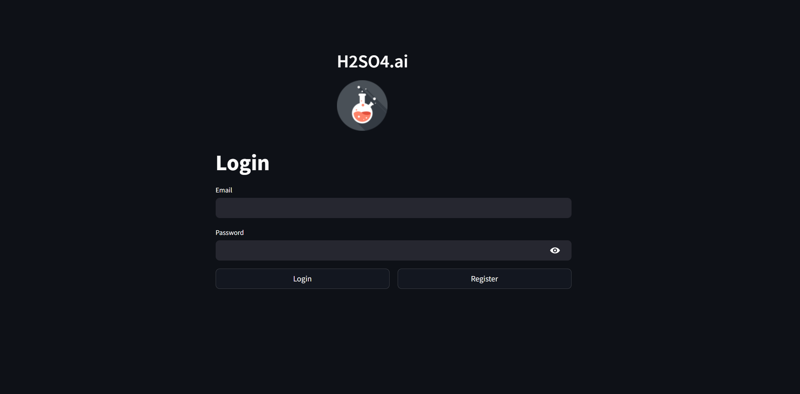
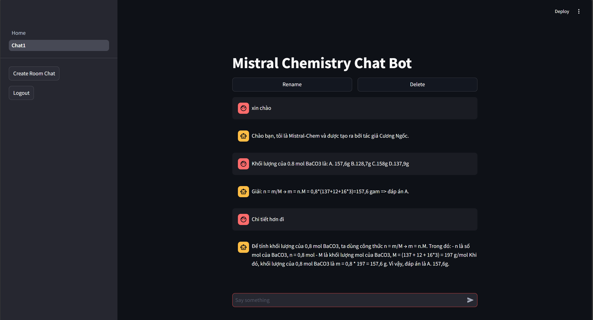

# Mistral Chemistry AI

## Introduction
This project aims to develop an advanced chatbot system by combining the power of Large Language Models (LLM) with the field of chemistry. The goal is to create a highly interactive and intelligent assistant that can answer complex queries, provide explanations, and assist in solving problems related to chemistry. By leveraging LLM's ability to process and generate human-like text, the chatbot will be able to understand scientific terminology, interpret chemical formulas, and engage in meaningful conversations about various topics such as organic chemistry, molecular biology, and chemical reactions. This fusion of cutting-edge AI technology with the sciences promises to deliver an innovative tool for both students and professionals in the field of chemistry.
### Login:


### Chat


## Setup

```bash 
git clone https://github.com/Luke-lab2002/StreamlitChemistryChatBot.git

cd StreamlitChemistryChatBot

streamlit run app.py
```